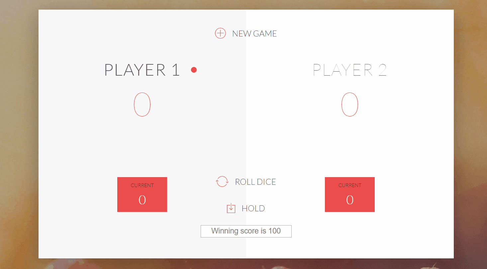

GAME RULES:

- The game has 2 players, playing in rounds
- In each turn, a player rolls a dice as many times as he whishes. Each result get added to his ROUND score
- BUT, if the player rolls a 1, all his ROUND score gets lost. After that, it's the next player's turn
- The player can choose to 'Hold', which means that his ROUND score gets added to his GLOBAL score. After that, it's the next player's turn
- The first player to reach 100 points on GLOBAL score wins the game
- if player gets 4 sixes in the row, all of his/hers scores reset to 0!!!
- Players can decide type winning score in input field, and game will be going on till one of the players reaches total score that is equal or over inputed number

